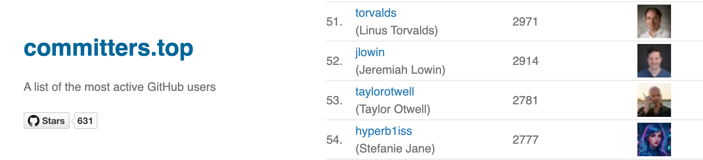

# 🌠 𝓱 𝔂 𝓹 𝓮 𝓻 𝓫 𝟏 𝓲 𝓼 𝓼 ✨ ⎊ ⨳ ✵ ⊹

    
    
    
    
    

Hey there! I'm **Stefanie Jane**, aka **hyperb1iss**— a creative tech person based in Seattle. I'm
passionate about building awesome tools to help build stuff faster, but what I really love is making
art with code. If you like the stuff I'm creating and want to see me create more, please consider becoming
a sponsor! Every bit helps and is super appreciated!!

## 🌟 Me!!

- **💻 Principal software engineer** of 25 years, working on some pretty cool stuff.
- **📱 Created [CyanogenMod](https://en.wikipedia.org/wiki/CyanogenMod)** (now [LineageOS](https://lineageos.org/)), a little revolution!
- **🔧 Open-source**- [_star_ and check out my repos!](https://github.com/hyperb1iss?tab=repositories)

    

## 🔮 Current Projects

    
    
    
    
    
    
    

### 🤖 AI & Developer Tools

- 🔮 [sibyl](https://github.com/hyperb1iss/sibyl) — Collective intelligence runtime with persistent memory, agent orchestration & knowledge graphs
- ✨ [git-iris](https://github.com/hyperb1iss/git-iris) — AI-powered git workflow with smart commits, changelogs & code reviews
- 🤖 [droidmind](https://github.com/hyperb1iss/droidmind) — MCP bridge for AI ↔ Android device control & debugging
- 🎭 [ghostty-automator](https://github.com/hyperb1iss/ghostty-automator) — Ghostty fork with IPC automation protocol for AI terminal control
- 🐍 [ghostty-automator-python](https://github.com/hyperb1iss/ghostty-automator-python) — Playwright-style Python library & MCP server for terminal automation
- 💬 [q](https://github.com/hyperb1iss/q) — Minimal Claude CLI with pipe mode, TUI & agent capabilities
- 📎 [contexter](https://github.com/hyperb1iss/contexter) — Extract codebase context for LLMs via REST API, Chrome extension & CLI

### 🦋 Agent Skills

skills.sh-compatible plugins that give AI agents domain expertise

- ⚡ [hyperskills](https://github.com/hyperb1iss/hyperskills) — 23 elite agents across 7 domains: fullstack, AI/ML, platform, security, growth & more
- 🤖 [hyperdroid-skill](https://github.com/hyperb1iss/hyperdroid-skill) — Master Android from ADB to custom ROMs — device debugging, fastboot, LineageOS
- 🔮 [moonrepo-skill](https://github.com/hyperb1iss/moonrepo-skill) — Deep knowledge of moon & proto for polyglot monorepo builds

### ⚡ SilkCircuit

My signature electric aesthetic dev environment across platforms

- 🌃 [silkcircuit-nvim](https://github.com/hyperb1iss/silkcircuit-nvim) — Vibrant Neovim colorscheme with 5 variants & 40+ plugin support
- 🏠 [silkcircuit-theme](https://github.com/hyperb1iss/silkcircuit-theme) — Neon-glowing Home Assistant theme, available on HACS
- 🛠️ [dotfiles](https://github.com/hyperb1iss/dotfiles) — Cross-platform dev environment with SilkCircuit styling & modern CLI tools

### 🎨 Creative Coding

Art with code — visual effects, terminal aesthetics, and generative experiments

- 🎨 [lightscript-workshop](https://github.com/hyperb1iss/lightscript-workshop) — TypeScript framework for custom SignalRGB effects with WebGL
- 😺 [chromacat](https://github.com/hyperb1iss/chromacat) — Terminal colorizer with 40+ themes & trippy gradient animations
- ⚡ [context-engineering-demo](https://github.com/hyperb1iss/context-engineering-demo) — Animated React presentation on orchestrating AI agents

### 💡 SignalRGB Stuff

Go FULL RGB with my Home Assistant integrations

- 🐍 [signalrgb-python](https://github.com/hyperb1iss/signalrgb-python) — Python client & CLI for SignalRGB Pro
- 🏠 [signalrgb-homeassistant](https://github.com/hyperb1iss/signalrgb-homeassistant) — Home Assistant integration
- 💡 [hyper-light-card](https://github.com/hyperb1iss/hyper-light-card) — Custom HA card with dynamic color-aware UI

### 🛠️ Developer Utilities

- 💎 [silkprint](https://github.com/hyperb1iss/silkprint) — Markdown-to-PDF engine with 40+ themes, syntax highlighting & publication-ready output
- 🌐 [unifly](https://github.com/hyperb1iss/unifly) — CLI + TUI for UniFi network controllers with async Rust & ratatui
- 🔧 [next-dynenv](https://github.com/hyperb1iss/next-dynenv) — Runtime environment variables for Next.js — one build, many deploys
- 🌀 [aeonsync](https://github.com/hyperb1iss/aeonsync) — Flexible remote backup with incremental snapshots & smart retention
- 🧜‍♀️ [siren](https://github.com/hyperb1iss/siren) — Unified linting frontend for 5+ languages with vibrant output
- 🔪 [git-surgeon](https://github.com/hyperb1iss/git-surgeon) — Safe, complex git history operations — scrub secrets, rewrite authors

### 🌈 RGB & Hardware

- 🎮 [uchroma](https://github.com/hyperb1iss/uchroma) — Revamped Linux RGB control for Razer Chroma with Rust async backend, GTK4 GUI & animation engine

## 🌙 Legacy Projects

- 🖥️ [vncflinger](https://github.com/hyperb1iss/vncflinger) — System-level VNC server for Android

### 🌠 Other contributions

I package some Python libraries for Debian/Ubuntu and contribute to various other open-source odds and ends.

## 🎤 Talks & keynotes

I've shared my experiences and insights on **embedded systems**, **Android roms**, **Android internals**, and **audio programming** at conferences and product launches worldwide.

## 🌌 Let's connect!

Find me at any of my links! If you like my work, star, follow, and [sponsor my open-source work](https://github.com/sponsors/hyperb1iss)! 💜⚡️

