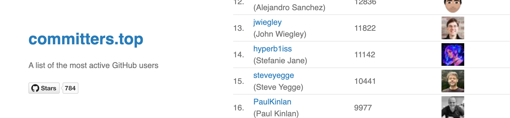

  

  <a href="https://hyperbliss.tech">hyperbliss.tech</a>&nbsp;&nbsp;·&nbsp;&nbsp;
  <a href="https://bsky.app/profile/hyperbliss.tech">bluesky</a>&nbsp;&nbsp;·&nbsp;&nbsp;
  <a href="https://hachyderm.io/@bliss">mastodon</a>&nbsp;&nbsp;·&nbsp;&nbsp;
  <a href="https://linkedin.com/in/hyperb1iss">linkedin</a>&nbsp;&nbsp;·&nbsp;&nbsp;
  <a href="https://github.com/sponsors/hyperb1iss">sponsor 💜</a>

I'm **Stefanie Jane**, a creative tech person in Seattle! Professionally I'm building infrastructure for AI agents at scale, and along the way I've created cool stuff for mobile, VR, healthcare, data science, and media broadcasting. I'm also building a bunch of open source stuff that you should definitely check out: an epic RGB lighting engine, memory for AI agents, developer tools, AI agent skills, terminal UIs, and the SilkCircuit theme system that I use for everything. 

nerd credz: in a previous life, I created [CyanogenMod](https://en.wikipedia.org/wiki/CyanogenMod), which lives on as [LineageOS](https://lineageos.org/). 

   
  Among the most active GitHub users in the US, per <a href="https://committers.top/united_states">committers.top</a>

## 🔮 P R O J E C T S

<table>
  <tr>
    <td width="50%" valign="top">
      <h3>🪩 <a href="https://github.com/hyperb1iss/hypercolor">hypercolor</a></h3>
      
Open-source RGB lighting engine for Linux, Windows, and macOS. Effects are web pages, rendered by an embedded Servo browser, composited on the GPU by SparkleFlinger, and sampled onto every LED you own, every frame.

      Rust · <!-- v:hypercolor -->v0.3.2<!-- /v:hypercolor --> · <a href="https://hypercolor.lighting">hypercolor.lighting</a>
    </td>
    <td width="50%" valign="top">
      <h3>🔮 <a href="https://github.com/hyperb1iss/sibyl">sibyl</a></h3>
      
One CLI, one graph, every AI tool you use sharing memory. Cross-agent persistent memory for coding assistants, with a knowledge graph, task coordination, and source-preserving provenance. Self-hosted and yours to keep.

      Python · <!-- v:sibyl -->v1.2.2<!-- /v:sibyl --> · MCP + CLI
    </td>
  </tr>
  <tr>
    <td width="50%" valign="top">
      <h3>🪄 <a href="https://github.com/hyperb1iss/hyperskills">hyperskills</a></h3>
      
Focused agent skills for the things models don't already know. Double Diamond brainstorming, wave-based research, verification-driven planning and implementation, orchestration, and cross-model review, plus domain skills where model knowledge is stale: Astral Python, Tilt, TUI design. This is the workflow I run every day.

      Claude Code plugin · skills.sh
    </td>
    <td width="50%" valign="top">
      <h3>⚡ <a href="https://github.com/hyperb1iss/silkcircuit">silkcircuit</a></h3>
      
Electric meets elegant. One palette, one semantic system, a family of intensity variants, applied to Neovim, VS Code, terminals, Chrome, and the rest of the toolchain with WCAG AA contrast throughout. The visual identity behind everything on this page.

      Lua · Neon, Vibrant, Soft, Glow, and Dawn variants
    </td>
  </tr>
  <tr>
    <td width="50%" valign="top">
      <h3>🌐 <a href="https://github.com/hyperb1iss/unifly">unifly</a></h3>
      
UniFi network management for humans and agents. A full command set for scripting plus a live ratatui dashboard, both driven by one async engine that speaks every UniFi API.

      Rust · <!-- v:unifly -->v0.10.0<!-- /v:unifly --> · crates.io
    </td>
    <td width="50%" valign="top">
      <h3>✦ <a href="https://github.com/hyperb1iss/opaline">opaline</a></h3>
      
Token-based theme engine for Rust. Themes are TOML resolved through a palette → token → style → gradient pipeline, with a library of built-in themes, multi-stop gradients, and backends for ratatui, egui, and more.

      Rust · <!-- v:opaline -->v0.4.1<!-- /v:opaline --> · crates.io
    </td>
  </tr>
  <tr>
    <td width="50%" valign="top">
      <h3>💎 <a href="https://github.com/hyperb1iss/silkprint">silkprint</a></h3>
      
Markdown in your terminal or rendered to a publication-grade PDF, from one themed engine. A library of themes, mermaid diagrams, live theme switching, and search, all in the reader.

      Rust · terminal reader + PDF renderer
    </td>
    <td width="50%" valign="top">
      <h3>🎭 <a href="https://github.com/hyperb1iss/prezzer">prezzer</a></h3>
      
Presentations as code. A deck is a repository that renders with real React components and builds to a single HTML file you can present from a file URL, attach to an email, or drop on any static host. No cloud, no export pipeline.

      TypeScript · Bun · npm
    </td>
  </tr>
  <tr>
    <td width="50%" valign="top">
      <h3>🎹 <a href="https://github.com/hyperb1iss/blocksd">blocksd</a></h3>
      
Linux daemon for ROLI Blocks. Performs the MIDI SysEx handshake the hardware needs to stay awake, then exposes topology, LED control, and touch events. The Linux support ROLI never shipped.

      Python · <!-- v:blocksd -->v0.4.0<!-- /v:blocksd --> · PyPI
    </td>
    <td width="50%" valign="top">
      <h3>🛠️ <a href="https://github.com/hyperb1iss/dotfiles">dotfiles</a></h3>
      
macOS-first, works on Linux and WSL2. Modern CLI tools, a tuned shell, and SilkCircuit wired through every prompt, pager, and editor. Polished continuously since 2017, never rewritten. The foundation every project above is built on.

      Shell · since 2017
    </td>
  </tr>
</table>

## 📡 Recently shipped

<!-- releases starts -->
- **[hypercolor v0.3.2](https://github.com/hyperb1iss/hypercolor/releases/tag/v0.3.2)** · Aug 16 · Excessively glorious RGB orchestration for Linux, Windows, and macOS
- **[sibyl v1.2.2](https://github.com/hyperb1iss/sibyl/releases/tag/v1.2.2)** · Aug 14 · Collective intelligence runtime for AI agents. Knowledge graph + persistent memory
- **[hypercolor-hass v0.2.0](https://github.com/hyperb1iss/hypercolor-hass/releases/tag/v0.2.0)** · Aug 11 · Hypercolor RGB lighting orchestration as a first-class Home Assistant hub
- **[unifly v0.10.0](https://github.com/hyperb1iss/unifly/releases/tag/v0.10.0)** · Aug 7 · Elegant UniFi network management CLI & TUI - for humans and agents
- **[silkcircuit-theme v1.0.1](https://github.com/hyperb1iss/silkcircuit-theme/releases/tag/v1.0.1)** · Jun 28 · SilkCircuit: A Neon Dream for Home Assistant
- **[opaline v0.4.1](https://github.com/hyperb1iss/opaline/releases/tag/v0.4.1)** · May 20 · A token-based theme engine for Rust TUI applications
- **[git-iris v2.1.0](https://github.com/hyperb1iss/git-iris/releases/tag/v2.1.0)** · May 20 · An intelligent agent that understands your code and crafts perfect Git artifacts
- **[signalrgb-homeassistant v1.1.0](https://github.com/hyperb1iss/signalrgb-homeassistant/releases/tag/v1.1.0)** · Apr 8 · Transform your smart home lighting with the power of SignalRGB, now integrated…
<!-- releases ends -->

Refreshed every six hours from GitHub releases. Everything older is on the <a href="https://github.com/hyperb1iss?tab=repositories&sort=pushed">repositories tab</a>.

## 🗺️ The rest of the map

<table>
  <tr>
    <td width="50%" valign="top">

**RGB, lighting, and smart home**

- **[hypercolor-hass](https://github.com/hyperb1iss/hypercolor-hass)** · Hypercolor as a Home Assistant hub · HACS
- **[hyper-light-card](https://github.com/hyperb1iss/hyper-light-card)** · HA card that recolors itself to the running effect
- **[uchroma](https://github.com/hyperb1iss/uchroma)** · Razer Chroma on Linux, asyncio core, GTK4 GUI
- **[signalrgb-homeassistant](https://github.com/hyperb1iss/signalrgb-homeassistant)** · SignalRGB as an HA light entity · HACS
- **[signalrgb-python](https://github.com/hyperb1iss/signalrgb-python)** · Python client and CLI for SignalRGB Pro
- **[lightscript-workshop](https://github.com/hyperb1iss/lightscript-workshop)** · TypeScript + WebGL framework for SignalRGB effects
- **[silkcircuit-theme](https://github.com/hyperb1iss/silkcircuit-theme)** · SilkCircuit for Home Assistant · HACS

**Terminal, tooling, and infrastructure**

- **[chromacat](https://github.com/hyperb1iss/chromacat)** · terminal colorizer with gradient animation, the kitty
- **[shared-workflows](https://github.com/hyperb1iss/shared-workflows)** · reusable GitHub Actions for the whole ecosystem
- **[homebrew-tap](https://github.com/hyperb1iss/homebrew-tap)** · `brew tap hyperb1iss/tap` for the CLIs and the Hypercolor app
- **[git-surgeon](https://github.com/hyperb1iss/git-surgeon)** · scrub secrets, rewrite authors, truncate history safely
- **[aeonsync](https://github.com/hyperb1iss/aeonsync)** · remote backups with incremental snapshots and retention
- **[next-dynenv](https://github.com/hyperb1iss/next-dynenv)** · runtime env vars for Next.js, one build for many deploys (fork)
- **[context-engineering-demo](https://github.com/hyperb1iss/context-engineering-demo)** · a talk on context engineering, built by context engineering
- **[hyperbliss.tech](https://github.com/hyperb1iss/hyperbliss.tech)** · the website, nerd city

</td>
    <td width="50%" valign="top">

**Agents, MCP, and skills**

- **[droidmind](https://github.com/hyperb1iss/droidmind)** · control and debug Android devices from any MCP client
- **[git-iris](https://github.com/hyperb1iss/git-iris)** · AI git workflow: commits, changelogs, reviews, studio TUI
- **[vigil](https://github.com/hyperb1iss/vigil)** · agents that watch your PRs, fix feedback, rebase, and reply
- **[hyperdroid-skill](https://github.com/hyperb1iss/hyperdroid-skill)** · Android from ADB to custom ROMs, as an agent skill
- **[moonrepo-skill](https://github.com/hyperb1iss/moonrepo-skill)** · moon and proto for polyglot monorepos, as an agent skill
- **[lucidity-mcp](https://github.com/hyperb1iss/lucidity-mcp)** · prompt-driven code quality analysis over MCP
- **[django-mcp](https://github.com/hyperb1iss/django-mcp)** · expose Django models, admin, and tools over MCP
- **[ghostty-automator](https://github.com/hyperb1iss/ghostty-automator)** · Ghostty fork with an IPC automation protocol, plus a [Python driver](https://github.com/hyperb1iss/ghostty-automator-python) and MCP server
- **[q](https://github.com/hyperb1iss/q)** · the tiniest Claude CLI: ask, pipe, chat
- **[hermes-sibyl-memory](https://github.com/hyperb1iss/hermes-sibyl-memory)** · Sibyl memory for Hermes Agent

**Android and earlier**

- **[CyanogenMod](https://en.wikipedia.org/wiki/CyanogenMod)** · the custom Android distribution that ran on tens of millions of devices, now [LineageOS](https://lineageos.org/)
- **[vncflinger](https://github.com/hyperb1iss/vncflinger)** · system-level VNC server for Android
- **[fake-backlight](https://github.com/hyperb1iss/fake-backlight)** · automatic backlight control through xbacklight or xrandr

</td>
  </tr>
</table>

## 🎤 Talks

I've spoken on Android internals, custom ROMs, embedded systems, and audio programming at conferences and product launches worldwide.

## 💜 Support

Everything here is free and open source. If something earned a place in your workflow, star it so others find it, or [sponsor](https://github.com/sponsors/hyperb1iss) the next one.
